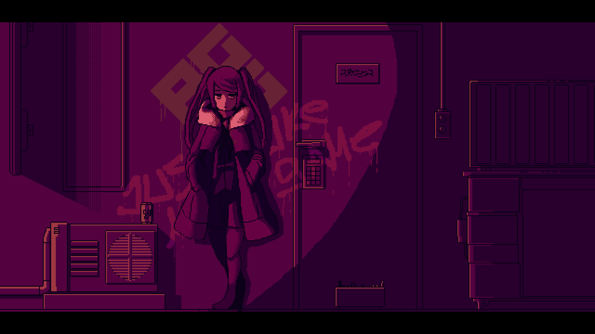

[](https://github.com/ryo-ma/github-profile-trophy)

<!--START_SECTION:waka-->


**🐱 My GitHub Data** 

> 📦 529.3 kB Used in GitHub's Storage 
 > 
> 🏆 0 Contributions in the Year 2025
 > 
> 🚫 Not Opted to Hire
 > 
> 📜 96 Public Repositories 
 > 
> 🔑 13 Private Repositories 
 > 
**I'm an Early 🐤** 

```text
🌞 Morning                1491 commits        ██████░░░░░░░░░░░░░░░░░░░   24.03 % 
🌆 Daytime                2557 commits        ██████████░░░░░░░░░░░░░░░   41.22 % 
🌃 Evening                1992 commits        ████████░░░░░░░░░░░░░░░░░   32.11 % 
🌙 Night                  164 commits         █░░░░░░░░░░░░░░░░░░░░░░░░   02.64 % 
```
📅 **I'm Most Productive on Monday** 

```text
Monday                   1091 commits        ████░░░░░░░░░░░░░░░░░░░░░   17.59 % 
Tuesday                  978 commits         ████░░░░░░░░░░░░░░░░░░░░░   15.76 % 
Wednesday                1009 commits        ████░░░░░░░░░░░░░░░░░░░░░   16.26 % 
Thursday                 850 commits         ███░░░░░░░░░░░░░░░░░░░░░░   13.70 % 
Friday                   956 commits         ████░░░░░░░░░░░░░░░░░░░░░   15.41 % 
Saturday                 718 commits         ███░░░░░░░░░░░░░░░░░░░░░░   11.57 % 
Sunday                   602 commits         ██░░░░░░░░░░░░░░░░░░░░░░░   09.70 % 
```


📊 **This Week I Spent My Time On** 

```text
🕑︎ Time Zone: Asia/Shanghai

💬 Programming Languages: 
TeX                      10 hrs 25 mins      ███████████████████████░░   93.23 % 
Standard ML              19 mins             █░░░░░░░░░░░░░░░░░░░░░░░░   02.97 % 
C++                      8 mins              ░░░░░░░░░░░░░░░░░░░░░░░░░   01.32 % 
Other                    5 mins              ░░░░░░░░░░░░░░░░░░░░░░░░░   00.84 % 
BibTeX                   5 mins              ░░░░░░░░░░░░░░░░░░░░░░░░░   00.83 % 

🔥 Editors: 
VS Code                  11 hrs 1 min        █████████████████████████   98.68 % 
Visual Studio            8 mins              ░░░░░░░░░░░░░░░░░░░░░░░░░   01.32 % 

🐱‍💻 Projects: 
PQE-Survey               10 hrs 40 mins      ████████████████████████░   95.57 % 
mlscript                 19 mins             █░░░░░░░░░░░░░░░░░░░░░░░░   02.97 % 
CF                       8 mins              ░░░░░░░░░░░░░░░░░░░░░░░░░   01.32 % 
CielShading              0 secs              ░░░░░░░░░░░░░░░░░░░░░░░░░   00.13 % 
Unknown Project          0 secs              ░░░░░░░░░░░░░░░░░░░░░░░░░   00.02 % 

💻 Operating System: 
Linux                    11 hrs              █████████████████████████   98.54 % 
Windows                  9 mins              ░░░░░░░░░░░░░░░░░░░░░░░░░   01.46 % 
```

**I Mostly Code in C#** 

```text
C#                       12 repos            ████░░░░░░░░░░░░░░░░░░░░░   14.29 % 
TeX                      9 repos             ███░░░░░░░░░░░░░░░░░░░░░░   10.71 % 
Python                   6 repos             ██░░░░░░░░░░░░░░░░░░░░░░░   07.14 % 
ShaderLab                3 repos             █░░░░░░░░░░░░░░░░░░░░░░░░   03.57 % 
Lean                     1 repo              ░░░░░░░░░░░░░░░░░░░░░░░░░   01.19 % 
```


 Last Updated on 26/04/2025 18:43:06 UTC
<!--END_SECTION:waka-->

✋ ❄☟⚐🕆☝☟❄ 🕈☟✌❄ ✋🕯👎 👎⚐ 🕈✌💧 ✋🕯👎 🏱☼☜❄☜☠👎 ✋ 🕈✌💧 ⚐☠☜ ⚐☞ ❄☟⚐💧☜ 👎☜✌☞📫💣🕆❄☜💧📬

⚐☼ 💧☟⚐🕆☹👎 ✋✍

Cover: [ジル・裏通り from ユーネ](https://www.pixiv.net/artworks/62127066)
