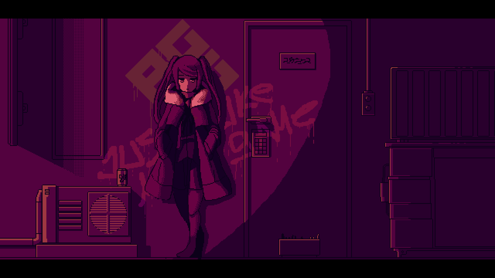

[](https://github.com/ryo-ma/github-profile-trophy)

<!--START_SECTION:waka-->


**🐱 My GitHub Data** 

> 📦 528.9 kB Used in GitHub's Storage 
 > 
> 🏆 601 Contributions in the Year 2025
 > 
> 🚫 Not Opted to Hire
 > 
> 📜 102 Public Repositories 
 > 
> 🔑 12 Private Repositories 
 > 
**I Mostly Code in C#** 

```text
TeX                      9 repos             ███░░░░░░░░░░░░░░░░░░░░░░   10.11 % 
Scala                    8 repos             ██░░░░░░░░░░░░░░░░░░░░░░░   08.99 % 
JavaScript               3 repos             █░░░░░░░░░░░░░░░░░░░░░░░░   03.37 % 
Lua                      2 repos             █░░░░░░░░░░░░░░░░░░░░░░░░   02.25 % 
Ruby                     1 repo              ░░░░░░░░░░░░░░░░░░░░░░░░░   01.12 % 
```


 Last Updated on 16/11/2025 18:46:16 UTC
<!--END_SECTION:waka-->

✋ ❄☟⚐🕆☝☟❄ 🕈☟✌❄ ✋🕯👎 👎⚐ 🕈✌💧 ✋🕯👎 🏱☼☜❄☜☠👎 ✋ 🕈✌💧 ⚐☠☜ ⚐☞ ❄☟⚐💧☜ 👎☜✌☞📫💣🕆❄☜💧📬

⚐☼ 💧☟⚐🕆☹👎 ✋✍

Cover: [ジル・裏通り from ユーネ](https://www.pixiv.net/artworks/62127066)
